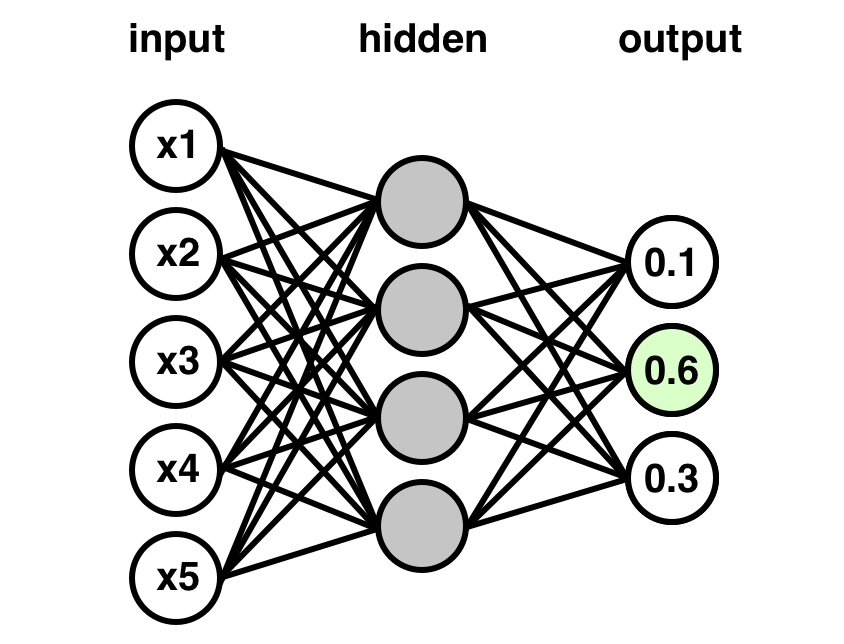

<p align="center">

</p>

### Usage

Run:
```
python3 NN_scratch.py
```

Kết quả chạy được
```
Reading 'data/seeds_dataset.csv'...
 -> X.shape = (210, 7), y.shape = (210,), n_classes = 3

Neural network model:
 input_dim = 7
 hidden_layers = [5]
 output_dim = 3
 eta = 0.1
 n_epochs = 400
 n_folds = 4
 seed_crossval = 1
 seed_weights = 1

Cross-validating with 4 folds...
 Fold 1/4: acc_train = 98.10%, acc_valid = 94.23% (n_train = 158, n_valid = 52)
 Fold 2/4: acc_train = 98.10%, acc_valid = 98.08% (n_train = 158, n_valid = 52)
 Fold 3/4: acc_train = 98.73%, acc_valid = 96.15% (n_train = 158, n_valid = 52)
 Fold 4/4: acc_train = 98.73%, acc_valid = 94.23% (n_train = 158, n_valid = 52)
  -> acc_train_avg = 98.42%, acc_valid_avg = 95.67%
```

### Các thư viện yêu cầu:

* numpy, pandas
